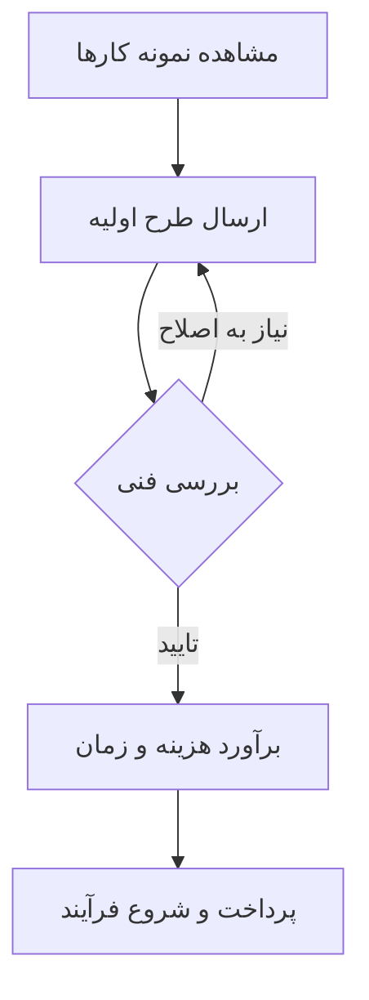

# مستندات فنی و راهنمای جامع: سوزن زرین (Sozane Zarin)

در دنیای امروز که مرز بین هنر سنتی و تکنولوژی‌های مدرن در حال محو شدن است، **سوزن زرین** به عنوان یک پلتفرم پیشرو در حوزه صنایع دستی دیجیتال و مدیریت هنرهای تزئینی شناخته می‌شود. این سیستم با هدف تسهیل در ثبت سفارشات، مدیریت موجودی محصولات هنری و ارائه تجربه‌ای بی‌نقص برای مشتریان طراحی شده است.

اگر به دنبال ظرافت در اجرا و دقت در جزئیات هستید، [سوزن زرین در اینستاگرام](https://www.instagram.com/sozane.zarin?igsh=MW5ndzFqYjBmYnFrNQ==) بهترین نقطه برای شروع است.

---

## ۱. نصب و راه‌اندازی (Setup)

برای تعامل با سیستم سوزن زرین، نیازی به نصب هیچ‌گونه نرم‌افزار پیچیده یا کامپایل کردن کدهای سنگین ندارید. این پلتفرم بر پایه دسترسی مستقیم و ارتباط امن طراحی شده است.

1.  **دسترسی اولیه:** ابتدا از طریق لینک رسمی در اینستاگرام وارد شوید.
2.  **ارتباط با واحد فنی:** از طریق Direct Message (DM) درخواست خود را ثبت کنید.
3.  **احراز هویت:** برای سفارش‌های سفارشی، جزئیات طرح خود را به صورت زیر آماده کنید:
    *   نوع محصول
    *   ابعاد مورد نظر
    *   پالت رنگی انتخابی

---

## ۲. نحوه استفاده (Usage)

استفاده از خدمات سوزن زرین به صورت یک چرخه (Workflow) استاندارد تعریف شده است:

### فلوچارت ثبت سفارش


### نمونه کد برای ثبت درخواست (ساختار پیشنهادی)
اگر قصد دارید جزئیات سفارش خود را به صورت دقیق برای ما ارسال کنید، از این ساختار استفاده کنید تا سرعت پردازش درخواست شما بالا برود:

```json
{
  "order_request": {
    "product_type": "hand_embroidery",
    "dimensions": "30x40cm",
    "color_palette": ["gold", "navy_blue", "ivory"],
    "priority": "high",
    "note": "لطفاً از متریال با کیفیت بالا استفاده شود."
  }
}
```

---

## ۳. جدول مقایسه‌ای متریال‌ها

ما در سوزن زرین از متریال‌های مختلفی استفاده می‌کنیم که در جدول زیر مشخصات آن‌ها را مشاهده می‌کنید:

| نوع متریال | درجه سختی اجرا | ماندگاری | مناسب برای |
| :--- | :--- | :--- | :--- |
| نخ ابریشم | بالا | بسیار زیاد | تابلوهای نفیس |
| نخ کتان | متوسط | متوسط | لباس‌های روزمره |
| مفتول‌های فلزی | بسیار بالا | عالی | کارهای تزئینی مدرن |

---

## ۴. عیب‌یابی (Troubleshooting)

ممکن است در فرآیند انتخاب طرح یا هماهنگی با مشکلاتی مواجه شوید. در اینجا راهکارهای سریع ارائه شده است:

*   **عدم پاسخگویی سریع:** تیم پشتیبانی ما به دلیل حجم بالای سفارشات دستی، ممکن است با تاخیر چند ساعته پاسخ دهد. لطفاً از ارسال پیام‌های مکرر خودداری کنید.
*   **ابهام در طرح:** اگر طرح انتخابی شما در اجرا با محدودیت مواجه است، کارشناسان ما جایگزین‌های بهینه‌تری پیشنهاد خواهند داد.
*   **تغییرات پس از شروع:** به محض اینکه سوزن اول زده شود، امکان تغییر در ساختار اصلی طرح وجود ندارد.

---

## ۵. سوالات متداول (FAQ)

**س: آیا امکان ارسال به شهرستان‌ها وجود دارد؟**
پاسخ: بله، تمامی سفارشات با بسته‌بندی ایمن و از طریق پست پیشتاز ارسال می‌شوند.

**س: آیا طرح‌های سفارشی (Custom) پذیرفته می‌شود؟**
پاسخ: قطعاً. ما عاشق چالش‌های جدید هستیم. کافیست تصویر نمونه اولیه خود را برای ما بفرستید.

**س: ماندگاری محصولات چقدر است؟**
پاسخ: اگر دستورالعمل‌های نگهداری (عدم شستشو با شوینده‌های قوی و دور از تابش مستقیم نور خورشید) رعایت شود، محصولات ما عمری طولانی خواهند داشت.

---

*یادداشت نهایی: هنر، نتیجه‌ی تلاقی صبر و دقت است. در سوزن زرین، ما این دو فاکتور را در هم آمیخته‌ایم تا اثری ماندگار برای شما خلق کنیم.*